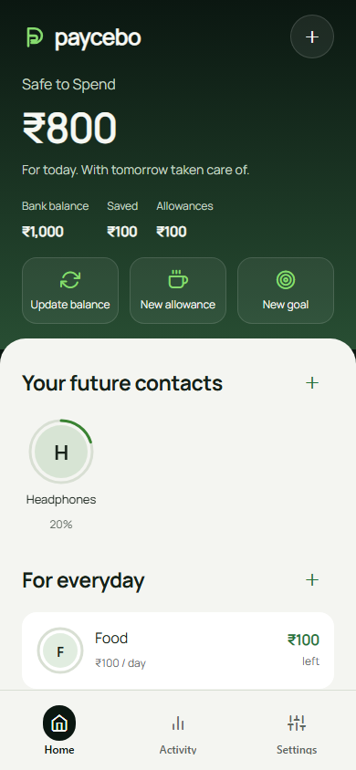

<p align="center">
  
</p>

<h1 align="center">Paycebo</h1>

<p align="center"><strong>Pay your future self.</strong></p>

<p align="center">Personal savings goals and everyday allowances, in one place.</p>

<p align="center">
  <a href="#preview">Preview</a> ·
  <a href="#features">Features</a> ·
  <a href="#quick-start">Quick start</a> ·
  <a href="#android-builds">Android builds</a>
</p>

Paycebo makes saving feel like paying a contact. Give your next trip or new headphones a goal, reserve money for everyday expenses, and see what is left to spend. Built with Expo and React Native for Android, iOS, and a browser preview.

Your balance is entered manually. Paycebo records savings and spending on your device; it does not connect to your bank or transfer money.

## Preview

<table>
  <tr>
    <td align="center" width="33%"><strong>Home</strong></td>
    <td align="center" width="33%"><strong>Goal conversation</strong></td>
    <td align="center" width="33%"><strong>Daily allowance</strong></td>
  </tr>
  <tr>
    <td align="center"></td>
    <td align="center"></td>
    <td align="center"></td>
  </tr>
  <tr>
    <td align="center"><strong>Step-by-step setup</strong></td>
    <td align="center"><strong>Activity</strong></td>
    <td align="center"><strong>Personal photos</strong></td>
  </tr>
  <tr>
    <td align="center"></td>
    <td align="center"></td>
    <td align="center"></td>
  </tr>
</table>

Select a screenshot to view it at full size. These are browser previews at a phone-sized viewport, using sample data. Native camera, keyboard, gesture, and text-scaling checks are tracked in [QA.md](QA.md).

## Features

- **Savings as contacts.** Create goals, record contributions, add notes, and follow progress in a conversation.
- **Everyday allowances.** Set daily, weekly, or monthly budgets for food, travel, and other spending. Record expenses and confirm when going over budget.
- **Safe to Spend.** See your tracked balance after savings and current allowance reservations.
- **A short first run.** Four focused steps, visible progress, an optional first saving, and answers that resume after closing the app.
- **Personal photos.** Choose from your gallery or take a photo for a goal or allowance. Images stay in local storage, with initials as a fallback.
- **History that stays useful.** Filter savings and expenses, edit allowances, and archive them while retaining spending history.
- **Your pace and tone.** Optional weekly saving pledges, in-app reminders, and playful or supportive messages.
- **An isolated demo.** Explore sample goals without changing your personal savings.

## Quick start

Requires **Node.js 22.13+**, npm, and an Expo SDK 55-compatible Expo Go app or development build. Node.js 24 is recommended.

```sh
git clone https://github.com/theadhithyankr/paycebo.git
cd paycebo
npm ci
npm start
```

Scan the QR code with a compatible Expo Go app, or use a native development build.

| Command | Purpose |
| --- | --- |
| `npm start` | Start the Expo development server |
| `npm run web` | Open the browser preview |
| `npm run android` | Build and run on an Android device or emulator |
| `npm run ios` | Build and run on an iOS Simulator; requires macOS and Xcode |

On Windows PowerShell, use `npm.cmd` and `npx.cmd` if script execution is disabled. Local Android builds require the Android SDK, Java, and Gradle dependencies. After adding native modules or changing permissions, regenerate an existing local Android project with `npx expo prebuild --platform android --no-install` before building.

## Android builds

The repository includes two EAS profiles:

| Profile | Output | Use |
| --- | --- | --- |
| `preview` | APK | Install directly on an Android device |
| `production` | AAB | Upload to Google Play |

```sh
npx eas-cli@latest login

# Installable Android APK
npx eas-cli@latest build --platform android --profile preview

# Google Play Android App Bundle
npx eas-cli@latest build --platform android --profile production
```

Follow the Expo project and signing prompts. EAS provides a download link when the build finishes. Native directories are ignored, so EAS generates them from the app configuration.

## How the money works

Amounts are stored as integer paise and displayed in INR.

```text
Safe to Spend = tracked bank balance
              − savings reserved for goals
              − remaining current-period allowances
```

Saving toward a goal changes its reservation, while the tracked bank balance stays the same. Recording an allowance expense reduces the tracked bank balance and the remaining allowance together.

For example, a ₹1,000 balance with a ₹100 food allowance leaves ₹900 Safe to Spend. After recording ₹30 spent, the balance is ₹970, the allowance has ₹70 left, and Safe to Spend remains ₹900.

Daily allowances reset at local midnight, weekly allowances on Monday, and monthly allowances on the first. Unused amounts do not roll over. A funding deficit remains visible and pauses new savings contributions.

## Development

| Layer | Tools |
| --- | --- |
| App and navigation | Expo SDK 55, React Native, Expo Router, TypeScript |
| UI | NativeWind 4, Tailwind CSS 3, owned gluestack primitives, Manrope |
| Motion and graphics | Reanimated, React Native SVG, Expo LinearGradient |
| Persistence | AsyncStorage; native Documents / browser IndexedDB for photos |

Screens live in `app/`. Shared UI is in `src/components/`, money rules and persistence are in `src/lib/`, and app state is in `src/state/`.

```sh
npm run check          # Domain/storage tests and TypeScript checks
npm run verify:source  # Parse app and library TypeScript sources
npm run export         # Production bundles for Android, iOS, and web
```

The current implementation has 50 automated tests covering money calculations, allowances, period resets, migration, draft recovery, and storage failures. Browser walkthroughs and production exports passed; native device checks remain open in the QA guide.

## Data and project notes

Personal and demo sessions are stored separately. Changes are confirmed after storage succeeds, and older snapshots migrate without changing savings history. Clearing app storage or uninstalling removes native data; clearing browser site data removes the web session and its photos. This version has no cloud sync or backup.

| Document | Contents |
| --- | --- |
| [Product notes](PRODUCT.md) | Audience, capabilities, and product constraints |
| [Design system](DESIGN.md) | Colors, typography, components, and interaction rules |
| [QA guide](QA.md) | Acceptance scenarios and verification boundaries |
| [Roadmap](ROADMAP.md) | Planned features and the proposed one-time Pro upgrade |
| [Attribution](THIRD_PARTY_NOTICES.md) | Retained third-party design notices |
