<p align="center">
  
</p>

<h1 align="center">Paycebo</h1>

<p align="center"><strong>Pay your future self.</strong></p>

<p align="center">Personal savings goals and everyday allowances, in one place.</p>

<p align="center">
  <a href="#preview">Preview</a> ·
  <a href="#features">Features</a> ·
  <a href="#quick-start">Quick start</a> ·
  <a href="#android-builds">Android builds</a>
</p>

Paycebo makes saving feel like paying a contact. Give your next trip or new headphones a goal, reserve money for everyday expenses, and see what is left to spend. Built with Expo and React Native for Android, iOS, and a browser preview.

Your balance is entered manually. Paycebo records savings and spending on your device; it does not connect to your bank or transfer money.

## Preview

<table>
  <tr>
    <td align="center" width="33%"><strong>Home</strong></td>
    <td align="center" width="33%"><strong>Goal conversation</strong></td>
    <td align="center" width="33%"><strong>Daily allowance</strong></td>
  </tr>
  <tr>
    <td align="center">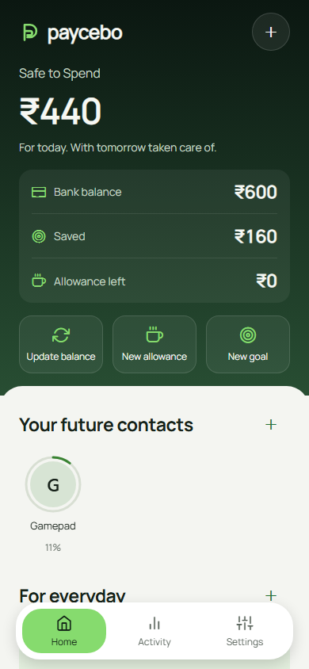</td>
    <td align="center">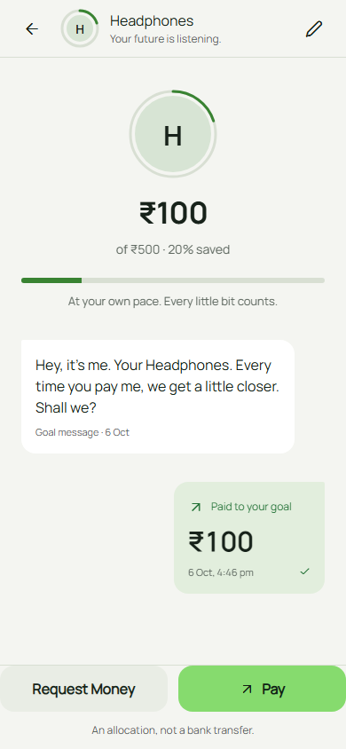</td>
    <td align="center">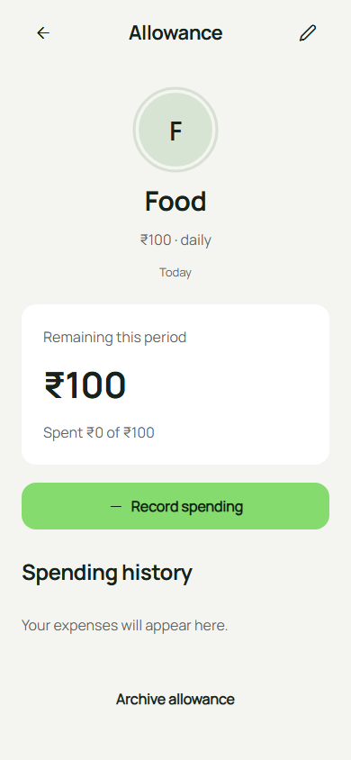</td>
  </tr>
  <tr>
    <td align="center"><strong>Step-by-step setup</strong></td>
    <td align="center"><strong>Activity</strong></td>
    <td align="center"><strong>Personal photos</strong></td>
  </tr>
  <tr>
    <td align="center">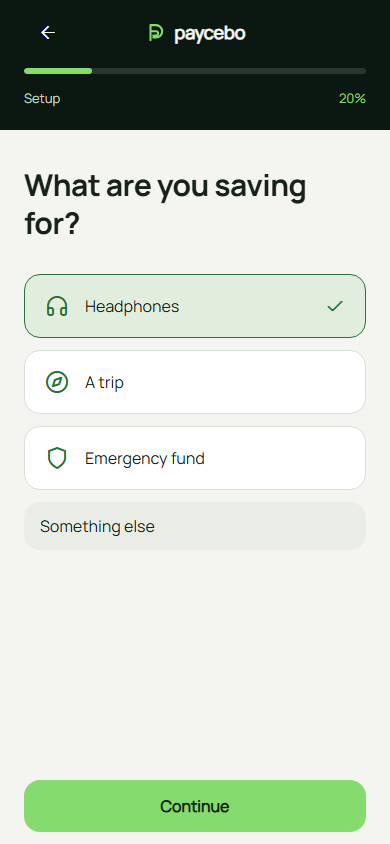</td>
    <td align="center">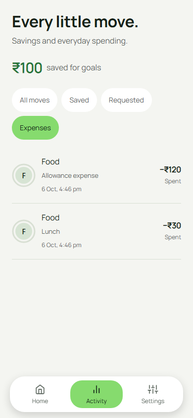</td>
    <td align="center">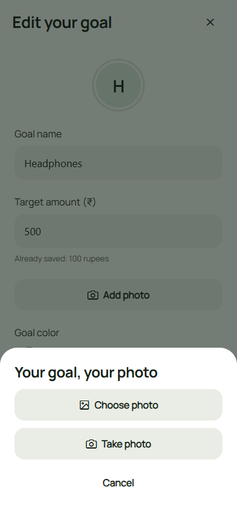</td>
  </tr>
</table>

Select a screenshot to view it at full size. These are browser previews at a phone-sized viewport, using sample data. Native camera, keyboard, gesture, and text-scaling checks are tracked in [QA.md](QA.md).

<table>
  <tr><td align="center"><strong>Dark appearance</strong></td><td align="center"><strong>Appearance settings</strong></td><td align="center"><strong>First goal created</strong></td></tr>
  <tr>
    <td align="center">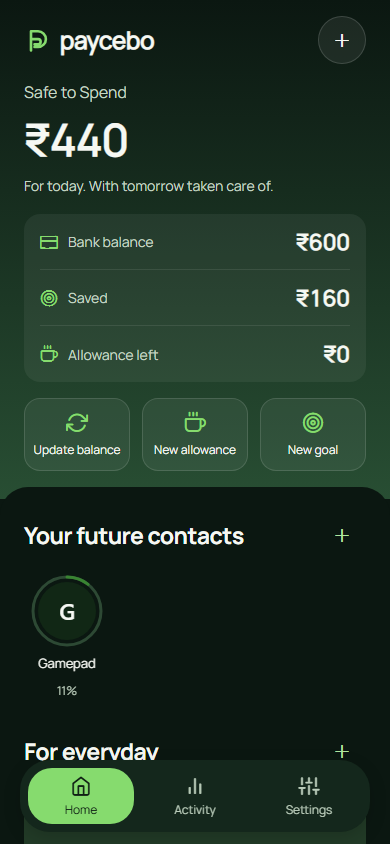</td>
    <td align="center">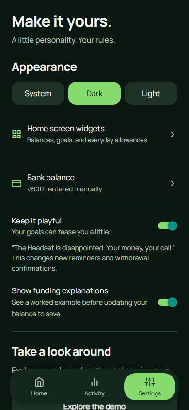</td>
    <td align="center">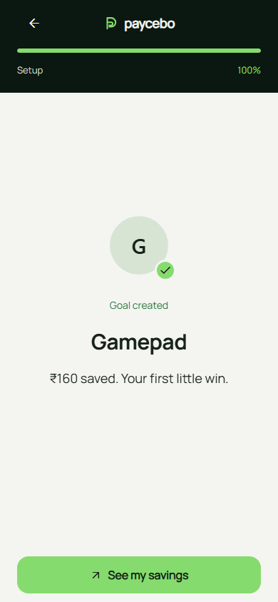</td>
  </tr>
</table>

## Features

- **Savings as contacts.** Create goals, record contributions, add notes, and follow progress in a conversation.
- **Everyday allowances.** Set daily, weekly, or monthly budgets for food, travel, and other spending. Record expenses and confirm when going over budget.
- **Clear funding choices.** When a goal contribution exceeds available funds, review a tracked-balance correction or shortfall top-up before saving. Optional worked examples can be switched off.
- **Safe to Spend.** See your tracked balance after savings and current allowance reservations.
- **A short first run.** Four focused steps, visible progress, an optional first saving, and answers that resume after closing the app.
- **Personal photos.** Choose from your gallery or take a photo for a goal or allowance. Images stay in local storage, with initials as a fallback.
- **History that stays useful.** Filter savings and expenses, edit allowances, and archive them while retaining spending history.
- **Your pace and tone.** Optional weekly saving pledges, in-app reminders, and playful or supportive messages.
- **Light and dark.** Follow your device appearance or choose Light or Dark in Settings.
- **Android home-screen widgets.** Keep Safe to Spend, a chosen goal, or a chosen allowance on your launcher. Configure each widget and hide amounts when preferred. Widgets use personal data even while the app is in demo mode.
- **An isolated demo.** Explore sample goals without changing your personal savings.

## Quick start

Requires **Node.js 22.13+**, npm, and an Expo SDK 55-compatible Expo Go app or development build. Node.js 24 is recommended.

```sh
git clone https://github.com/theadhithyankr/paycebo.git
cd paycebo
npm ci
npm start
```

Scan the QR code with a compatible Expo Go app to explore the app. Android widgets require a fresh native development build or EAS APK; Expo Go, iOS, and the browser do not provide home-screen widgets.

| Command | Purpose |
| --- | --- |
| `npm start` | Start the Expo development server |
| `npm run web` | Open the browser preview |
| `npm run android` | Build and run on an Android device or emulator |
| `npm run ios` | Build and run on an iOS Simulator; requires macOS and Xcode |

On Windows PowerShell, use `npm.cmd` and `npx.cmd` if script execution is disabled. Local Android builds require the Android SDK, Java, and Gradle dependencies. After adding native modules or changing permissions, regenerate an existing local Android project with `npx expo prebuild --platform android --no-install` before building.

## Android builds

The repository includes two EAS profiles:

| Profile | Output | Use |
| --- | --- | --- |
| `preview` | APK | Install directly on an Android device |
| `production` | AAB | Upload to Google Play |

```sh
npx eas-cli@latest login

# Installable Android APK
npx eas-cli@latest build --platform android --profile preview

# Google Play Android App Bundle
npx eas-cli@latest build --platform android --profile production
```

Follow the Expo project and signing prompts. EAS provides a download link when the build finishes. Native directories are ignored, so EAS generates them from the app configuration.

## Native Android preview

<table><tr>
<td align="center">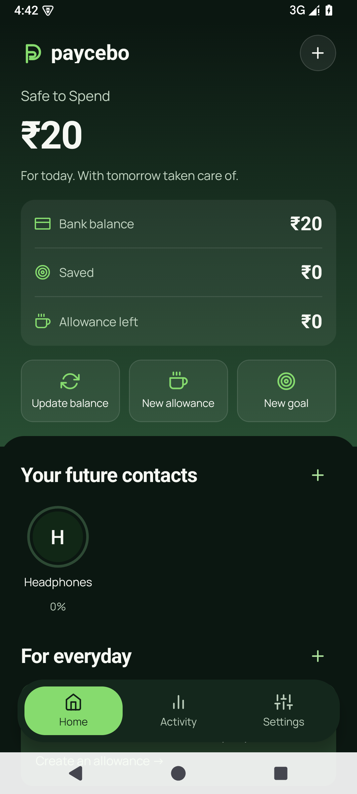</td>
<td align="center">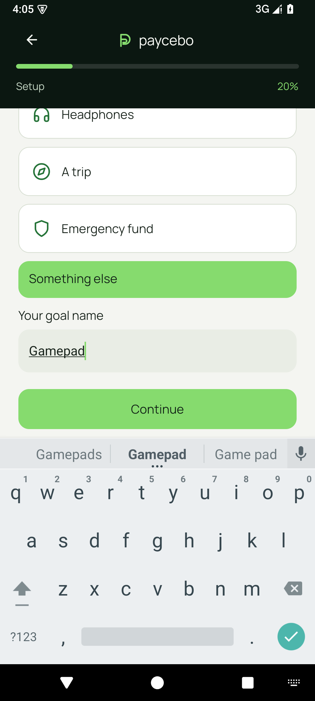</td>
<td align="center">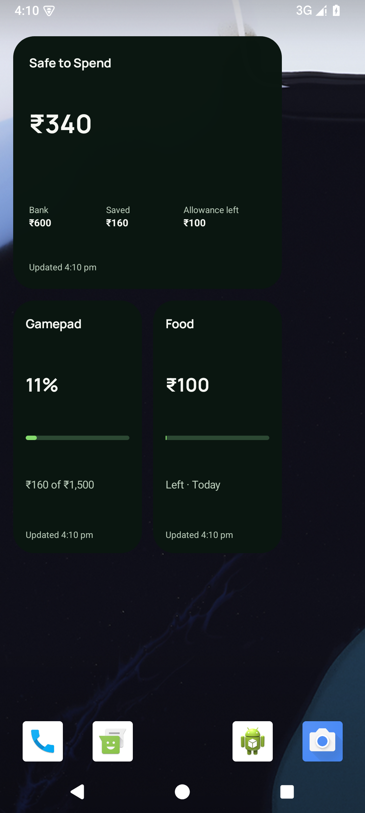</td>
</tr></table>

Captured on an isolated API 35 Android emulator using sample data. The native shell was compiled by EAS; the latest layout fixes were checked with a locally signed QA APK using the current exported bundle. Generate a fresh EAS build for distribution.

## When a goal needs more funds

With a tracked balance of ₹20, entering a ₹14,000 contribution opens a review window. Cancel preserves your input. Set the required tracked balance and save, or add the ₹13,980 shortfall and save; both record the contribution in one storage write. Existing savings and allowance reservations are included in the calculation. Confirm only funds you actually have; Paycebo does not transfer money.

The optional worked example explains the arithmetic. Toggle **Show explanations** in the window or **Show funding explanations** in Settings; the preference persists across sessions.

<p align="center">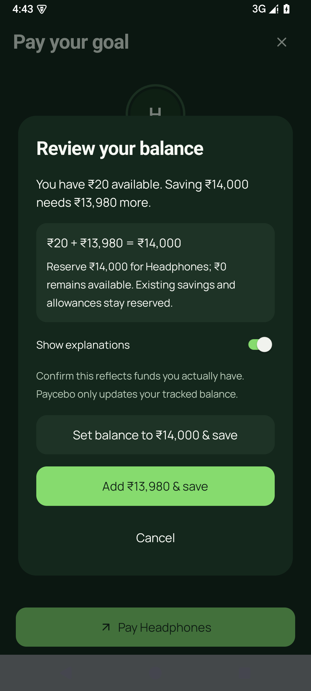</p>

## Android widgets

Create a personal savings space, then open **Settings ? Home-screen widgets**. Pin Balance, Goal, or Allowance. On launchers that skip configuration, the widget starts with the personal item shown in the app preview. Long-press it to open widget settings, choose an item, and save. You can also find Paycebo in your launcher's widget picker and reconfigure an existing widget through its launcher menu.

Each widget has its own **Show amounts** setting. Tapping a widget opens the associated personal screen. Widgets refresh after personal changes, when the app returns to the foreground, and on a best-effort Android schedule; launcher and battery restrictions can delay background updates. The displayed update time helps identify stale values. Archived or deleted items show a recovery prompt.

## How the money works

Amounts are stored as integer paise and displayed in INR.

```text
Safe to Spend = tracked bank balance
              − savings reserved for goals
              − remaining current-period allowances
```

Saving toward a goal changes its reservation, while the tracked bank balance stays the same. Recording an allowance expense reduces the tracked bank balance and the remaining allowance together.

For example, a ₹1,000 balance with a ₹100 food allowance leaves ₹900 Safe to Spend. After recording ₹30 spent, the balance is ₹970, the allowance has ₹70 left, and Safe to Spend remains ₹900.

Daily allowances reset at local midnight, weekly allowances on Monday, and monthly allowances on the first. Unused amounts do not roll over. A funding deficit remains visible and pauses new savings contributions.

## Development

| Layer | Tools |
| --- | --- |
| App and navigation | Expo SDK 55, React Native, Expo Router, TypeScript |
| UI | NativeWind 4, Tailwind CSS 3, owned gluestack primitives, Manrope |
| Motion and graphics | Reanimated, React Native SVG, Expo LinearGradient |
| Persistence | AsyncStorage; native Documents / browser IndexedDB for photos |
| Native forms and widgets | React Native Keyboard Controller, React Native Android Widget |

Regenerate launcher and splash assets from the approved SVG with `npm run brand:generate`; this developer script also requires Python with Pillow for opaque icon output.

Screens live in `app/`. Shared UI is in `src/components/`, money rules and persistence are in `src/lib/`, and app state is in `src/state/`.

```sh
npm run check          # Domain/storage tests and TypeScript checks
npm run verify:source  # Parse app and library TypeScript sources
npm run export         # Production bundles for Android, iOS, and web
```

The current implementation has 65 automated tests covering money calculations, allowances, period resets, migration, draft recovery, storage failures, appearance preferences, widget values/privacy, and atomic goal funding. Browser walkthroughs, Android emulator checks and production exports passed within the boundaries recorded in the QA guide. iOS and physical-device acceptance checks remain open.

## Data and project notes

Personal and demo sessions are stored separately. Changes are confirmed after storage succeeds, and older snapshots migrate without changing savings history. Clearing app storage or uninstalling removes native data; clearing browser site data removes the web session and its photos. This version has no cloud sync or backup.

| Document | Contents |
| --- | --- |
| [Product notes](PRODUCT.md) | Audience, capabilities, and product constraints |
| [Design system](DESIGN.md) | Colors, typography, components, and interaction rules |
| [QA guide](QA.md) | Acceptance scenarios and verification boundaries |
| [Roadmap](ROADMAP.md) | Planned features and the proposed one-time Pro upgrade |
| [Attribution](THIRD_PARTY_NOTICES.md) | Retained third-party design notices |
